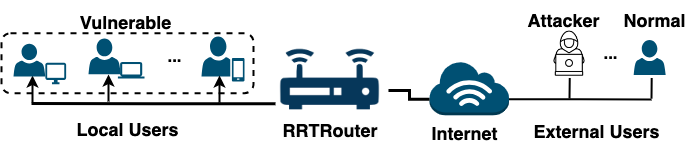
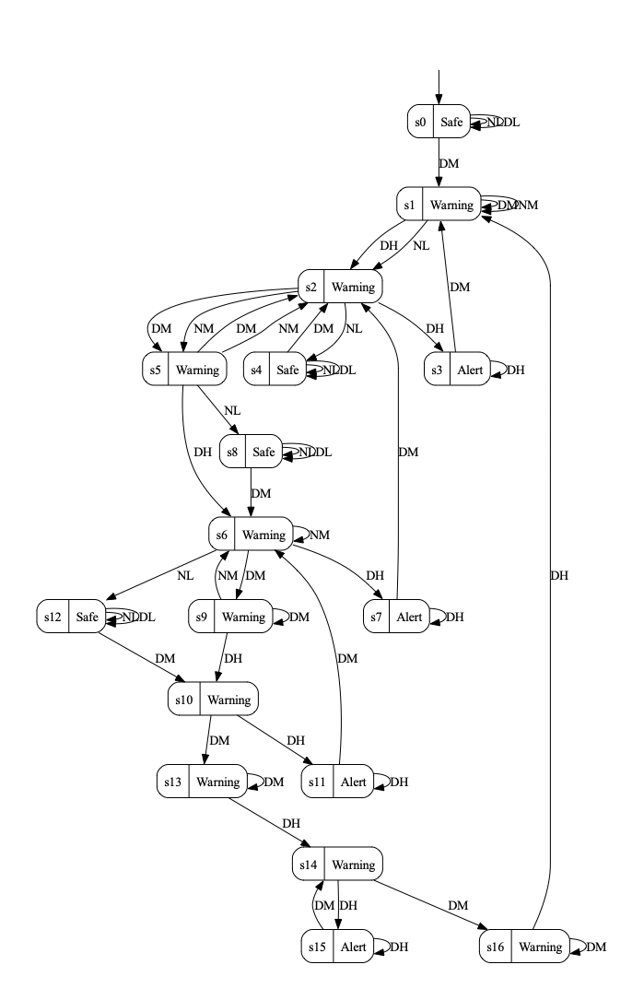

# Enhancing Automata Learning with Statistical Machine Learning: A Network Security Case Study

### MachinE Learning-enhanced passive Automata learning approach (MELA )

## Overview
The MELA approach is a method for learning state machine models for network security systems using time-series inputs and outputs. It leverages machine learning (ML) to abstract raw numeric network data into discrete intervals. These intervals correlate with the system's output regarding intrusion detection.

## Testbed
Our testbed uses a commercial service router for network intrusion detection, developed by [RabbitRun Technologies (RRT)](https://www.rabbit.run/). The goal is to model the behaviour of this router at a system level. We simulate various network flows that represent both normal and attack scenarios.

 <!-- Replace URL_OF_TESTBED_IMAGE with the actual URL where your testbed image is hosted -->

## Tools
The following tools and resources are used in our testbed:
- Python 3.8.10 - [More Info](https://www.python.org/downloads/release/python-3810/)
- Virtual Box 6.1 - [More Info](https://www.virtualbox.org/wiki/Downloads)
- Ubuntu 20.04 disc image - [Download](https://ubuntu.com/download/desktop)
- Kali Linux - [More Info](https://www.kali.org/)
- hping3 - [More Info](http://www.hping.org/)
- Metasploitable - [More Info](https://sourceforge.net/projects/metasploitable/)
- AALpy - [More Info](https://des-lab.github.io/AALpy/)

## Testbed Configuration
Our setup consists of three virtual machines (VMs), each deployed on a separate laptop. These VMs are configured as follows:
- VM-left simulates local users.
- VM-centre hosts the RRT router (RRTRouter).
- VM-right simulates external users and generates both normal traffic and DoS/DDoS packets using hping3.

 <!-- Replace URL_OF_CONFIGURATION_IMAGE with the actual URL where your configuration image is hosted -->

## Content Description
In this repository, we publish our implementations and experimental data. Please note that the RRTRouter and its associated data are proprietary to RabbitRun Technologies and cannot be shared.

### Repository Structure
- `Code`: Contains shell scripts (container.sh, hping.sh, hping_traffic.sh) for generating inputs with hping3, sending normal and attack flows, and includes the MELA code and baseline routines.
- `Data`: Includes input/output data, learning sets, and abstractions with labels for numeric network data and traces.
- `Evaluation`: Includes codes used for research question 1 and the test set.
- `Results`: This directory is organized into several subfolders, each containing specific types of results:
  - `RQ1`: Includes the results of [sequence](Evalution/Test%20set) execution on the learned models addressing research question 1, related to the complexity and conformance aspects.
  - `RQ2`: Contains the outcomes of model-checking for temporal properties that have been formulated based on the RRTRouter's requirements. Additionally, it includes exploratory analyses on RRTRouter's behavior using temporal queries.
  - `LearnedModel`: Contains [state machines](Results/LearnedModel) learned by MELA and the Manual baseline. For example, the figure below shows the Moore machine for the DDoS learning set, with '2nd' configuration, and abstracted by MELA:
       

In the depicted state machine, system outputs are annotated on the states, and transitions are labelled either as attack or normal flow ('D' for DDoS and 'N' for Normal), alongside the level of flow abstraction ('L' for Low, 'M' for Medium, 'H' for High).

